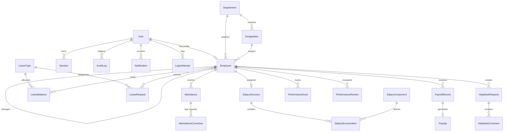

# Dayflow HRMS

> An intelligent, secure, and modular Human Resource Management System engineered for managing the complete employee lifecycle.

*One Workforce. One System. One Flow.*

---

## 📖 Project Overview

Modern organizations frequently struggle with fragmented HR operations—juggling disconnected spreadsheets for attendance, third-party calculators for salary computation, and manual paper trails for leave approvals. This separation leads to data inconsistencies, compliance risks, and administrative fatigue.

**Dayflow HRMS** is an enterprise-grade, full-stack Human Resource & Compliance Station built with a backend-first philosophy and a modern editorial user interface. It bridges the gap between workforce operations and corporate governance by consolidating identity management, real-time attendance logging, multi-tier leave workflows, statutory payroll accounting, and employee self-service into a single unified platform.

Designed for fast-growing technology enterprises, HR administrators, and employees alike, Dayflow eliminates manual administrative friction through atomic database transactions, strict role-based access controls (RBAC), and actionable smart contextual insights.

---

## ⚡ Core Capabilities

| Module | Purpose | Status |
|---|---|---|
| **Authentication & RBAC** | Multi-role JWT sessioning, password policy enforcement, and sliding window rate limiting | `Active` |
| **Workforce Management** | Centralized employee directory, Kanban visualizer, document vault, and soft-delete compliance | `Active` |
| **Attendance & Shifts** | Live Systray punch-in/out, duplicate clock-in prevention, dynamic overtime & shift calculations | `Active` |
| **Leave Governance** | Multi-category balance tracking (PAL, Sick, Casual), 3-way conflict checks, and atomic approvals | `Active` |
| **Statutory Payroll** | Component-based salary structures (Basic, HRA, Medical, PF, PT, TDS) and single-page A4 PDF voucher generation | `Active` |
| **Performance Management** | KPI goal tracking with progress metrics and periodic 360 review workflows | `Active` |
| **Recruitment & Onboarding** | Job posting lifecycle, candidate pipelines, and structured onboarding task checklists | `Active` |
| **Helpdesk & Support** | Internal ticketing system with priority categorization, assignment, and threaded commentary | `Active` |
| **Notifications & Alerts** | Asynchronous in-app notification dispatch for approvals, requests, and system alerts | `Active` |
| **Smart HR Intelligence** | Heuristic analytical engine identifying attendance streaks, overtime burnout risks, and benchmarks | `Active` |
| **Audit & Compliance** | Immutable system event logging capturing actor IDs, entity modifications, and client timestamps | `Active` |

---

## 🎯 Key Features

### 🏢 Workforce Management
- **Centralized Employee Records:** Complete profile lifecycle storing personal credentials, emergency contacts, organizational hierarchy, and banking data.
- **Kanban & List Visualizers:** Interactive department filtering (`Engineering`, `Product Design`, `Finance & Accounts`, `Marketing`, `Sales`, `Human Resources`).
- **3-Step Guided Onboarding:** Profile initialization, statutory banking validation (PAN card & IFSC code regex masks), automated company Login ID sequencing, and secure password generation with real-time strength indicators.
- **Soft-Delete Architecture:** Compliance-grade data retention utilizing indexed `deletedAt` timestamps to preserve tax and payroll audit trails.

### ⏱️ Attendance & Shift Engine
- **Live Systray Widget:** Real-time shift clock-in/out with active duration counter and zero-latency status persistence.
- **Duplicate Punch Prevention:** Server-side timestamp validation rejecting duplicate check-ins and enforcing check-in prerequisites prior to checkout.
- **Dynamic Shift Categorization:** Automated calculation of daily work hours, splitting shifts into `PRESENT` (>= 8.0 hrs), `HALF_DAY` (< 8.0 hrs), and tracking overtime exceeding standard 8-hour thresholds.
- **Temporal Query Optimization:** PostgreSQL compound indexes enabling sub-millisecond weekly summaries, monthly calendars, and department punctuality reports.

### 🌴 Leave & Time-Off Governance
- **Multi-Category Quotas:** Automated balance ledgers for Paid Annual Leave (`PAL`), Sick Leave (`SL`), and Casual Leave (`CL`).
- **Triple-Check Validation Engine:** Evaluates sufficient remaining quota, prevents overlapping request ranges, and rejects leave requests that conflict with existing 'Present' attendance records (`LEAVE_DATE_CONFLICT`).
- **Atomic Approval Workflows:** Multi-table operations (leave status transition, balance decrement, and attendance calendar synchronization) wrapped in atomic Prisma transactions (`$transaction`) with automated rollback guarantees.

### 💰 Statutory Payroll & Electronic Payslips
- **Dynamic Salary Structuring:** Clear breakdown of earnings (Basic Pay, House Rent Allowance, Medical Allowance) and statutory deductions (Provident Fund, Professional Tax, TDS).
- **Single-Page PDF Vouchers:** Automated client-side high-resolution electronic salary slip PDF compiler with statutory breakdown, employee identifiers, and verified company branding formatted for standard A4 portrait output.

### 📈 Performance & Goal Management
- **Goal Tracking:** Milestone management with completion progress percentages, due dates, and status progression (`NOT_STARTED`, `IN_PROGRESS`, `COMPLETED`).
- **Structured Performance Reviews:** Self-assessment forms, reviewer feedback loops, strengths & improvement area matrices, and 1.0–5.0 rating scales.

### 🎫 Helpdesk & Notifications
- **Internal Ticketing:** Employee issue logging with category classification (`SALARY_ISSUE`, `ATTENDANCE_CORRECTION`, `LEAVE_ISSUE`, `DOCUMENT_REQUEST`), severity priorities (`LOW`, `MEDIUM`, `HIGH`, `URGENT`), and resolution timestamps.
- **Real-Time Notification Bell:** In-app badge counts and dropdown feed notifying stakeholders of status updates and required review actions.

### 🔒 Authentication & Enterprise Security
- **Multi-Role RBAC:** Granular authorization middleware protecting administrative actions across `ADMIN`, `HR`, and `EMPLOYEE` roles.
- **Brute-Force Rate Limiting:** Sliding-window rate limiting on `/api/v1/auth/login` and credential management routes.
- **Structured Field Validation:** Zod schemas returning structured error objects (`errors: { [field]: { message, field } }`) directly rendered by form components.
- **Security Headers & CORS:** Strict CORS origin whitelisting with credential handling and Helmet HTTP security headers.

---

## 🏛️ System Architecture

```text
┌──────────────────────────────────────────────────────────────────┐
│                      Frontend Presentation Layer                 │
│         React 19 / TypeScript / Vite / Tailwind CSS / Framer     │
│   • Obsidian Dark Theme      • Live Systray Status Widget        │
│   • Context State Layer      • Single-Page Payslip PDF Compiler  │
└─────────────────────────────────┬────────────────────────────────┘
                                  │
                                  │ HTTP / RESTful JSON (/api/v1)
                                  │ Authorization: Bearer <JWT>
                                  ▼
┌──────────────────────────────────────────────────────────────────┐
│                   Backend Express API Service (v1)               │
│   ┌──────────────────────────────────────────────────────────┐   │
│   │                      Middleware Pipeline                 │   │
│   │   • Helmet Security Headers   • CORS Whitelisting        │   │
│   │   • Sliding Rate Limiter      • Zod Validation Filter    │   │
│   │   • JWT Auth Token Verifier   • Role-Based Guard (RBAC)  │   │
│   └─────────────────────────────┬────────────────────────────┘   │
│                                 │                                │
│   ┌─────────────────────────────▼────────────────────────────┐   │
│   │                  Modular Domain Controllers              │   │
│   │   [Auth]      [Employees]    [Attendance]   [Leave]      │   │
│   │   [Payroll]   [Performance]  [Helpdesk]     [Audit]      │   │
│   └─────────────────────────────┬────────────────────────────┘   │
│                                 │                                │
│   ┌─────────────────────────────▼────────────────────────────┐   │
│   │               Business Services & Transaction Layer      │   │
│   │   • Atomic Prisma Transactions ($transaction)            │   │
│   │   • Heuristic Smart Analytics & Insight Engine           │   │
│   │   • Concurrency-Safe Sequence Login ID Generator         │   │
│   └─────────────────────────────┬────────────────────────────┘   │
└─────────────────────────────────┼────────────────────────────────┘
                                  │
                                  │ Type-Safe Query Engine
                                  ▼
┌──────────────────────────────────────────────────────────────────┐
│                    Prisma ORM (Data Access Layer)                │
└─────────────────────────────────┬────────────────────────────────┘
                                  │
                                  │ Native PostgreSQL Protocol
                                  ▼
┌──────────────────────────────────────────────────────────────────┐
│                    PostgreSQL 16 Relational Engine               │
│   • Composite Unique Constraints    • Compound Temporal Indexes  │
│   • Relational Integrity & Cascades • Indexed Soft-Deletes       │
└──────────────────────────────────────────────────────────────────┘
```

---

## 💻 Technology Stack

### Frontend Architecture
- **Core Library:** React 19 (`react`, `react-dom`)
- **Build Tool:** Vite 8
- **Language:** TypeScript
- **Styling:** Tailwind CSS v4 & Vanilla CSS Design Tokens
- **Animations:** Framer Motion
- **Icons:** Lucide React
- **Client Utilities:** Canvas Confetti, Custom Electronic PDF Generator

### Backend Architecture
- **Runtime:** Node.js (v20+ / v25+)
- **Web Framework:** Express.js 4
- **Language:** TypeScript (`tsc`, `ts-node-dev`)
- **Database & ORM:** PostgreSQL 16 via Prisma ORM 5
- **Authentication:** JSON Web Tokens (`jsonwebtoken`) & `bcryptjs`
- **Rate Limiting:** `express-rate-limit`
- **Validation Engine:** Zod
- **Security:** Helmet & CORS Whitelisting
- **Testing:** Jest, Supertest, `ts-jest`

---

## 🗄️ Database Schema & Data Models

The relational schema is defined in [`backend/prisma/schema.prisma`](./backend/prisma/schema.prisma) across 27 interconnected models:



---

## 🔌 API Reference

All backend routes are mounted under the `/api/v1` namespace with standardized JSON responses.

### Common Response Format
```json
{
  "success": true,
  "message": "Operation completed successfully",
  "data": { ... },
  "timestamp": "2026-08-22T17:00:00.000Z"
}
```

### Core API Endpoints

#### 1. System & Authentication
- `GET  /api/v1/health` — Service health check & uptime monitor
- `POST /api/v1/auth/login` — Authenticate credentials & issue JWT *(Rate-limited)*
- `POST /api/v1/auth/change-password` — Update user password *(Rate-limited)*
- `GET  /api/v1/auth/me` — Retrieve active authenticated session context

#### 2. Workforce Management
- `GET  /api/v1/employees` — Paginated directory search & department filter
- `POST /api/v1/employees` — Onboard employee with auto-generated ID sequence
- `GET  /api/v1/employees/:id` — Retrieve comprehensive profile details
- `PUT  /api/v1/employees/:id` — Update workforce record details
- `DELETE /api/v1/employees/:id` — Soft-delete employee archive

#### 3. Attendance & Shifts
- `POST /api/v1/attendance/check-in` — Clock in with server timestamp
- `POST /api/v1/attendance/check-out` — Clock out and calculate shift work hours
- `GET  /api/v1/attendance/today` — Current employee shift & systray state
- `GET  /api/v1/attendance/weekly` — 7-day breakdown with work/overtime totals
- `GET  /api/v1/attendance/monthly` — Calendar view with aggregate attendance rates
- `GET  /api/v1/attendance/insights` — Personal contextual smart insights
- `GET  /api/v1/attendance/insights/overview` — Organization-level benchmark insights *(HR/Admin)*
- `GET  /api/v1/attendance/analytics/overview` — Executive attendance overview metrics
- `GET  /api/v1/attendance/analytics/departments` — Departmental attendance breakdown

#### 4. Leave & Time-Off
- `GET  /api/v1/leave/types` — Retrieve active leave categories & quota rules
- `GET  /api/v1/leave/balances` — Retrieve remaining PAL, Sick, and Casual quotas
- `GET  /api/v1/leave/requests` — View paginated leave request history
- `POST /api/v1/leave/requests` — Submit leave request with 3-way validation
- `POST /api/v1/leave/requests/:id/cancel` — Cancel pending leave request
- `PATCH /api/v1/leave/requests/:id/approve` — Atomically approve request & deduct quota *(HR/Admin)*
- `PATCH /api/v1/leave/requests/:id/reject` — Reject leave request with feedback *(HR/Admin)*

#### 5. Payroll & Performance
- `GET  /api/v1/payroll/records` — Organization payroll run list
- `GET  /api/v1/payroll/payslips/:id` — Detailed statutory payslip breakdown
- `GET  /api/v1/performance/goals` — Active milestone goals
- `POST /api/v1/performance/goals` — Define milestone performance target
- `GET  /api/v1/performance/reviews` — Performance evaluation periods

#### 6. Helpdesk & Notifications
- `GET  /api/v1/helpdesk` — Support tickets query & priority filter
- `POST /api/v1/helpdesk` — Open support or correction ticket
- `GET  /api/v1/notifications` — In-app notification feed
- `PATCH /api/v1/notifications/:id/read` — Mark notification as read

---

## 📁 Repository Structure

```text
dayflow-hrms/
├── frontend/                        # Client-Side Application (React 19 + Vite)
│   ├── src/
│   │   ├── components/              # UI Components & Domain Views
│   │   │   ├── common/              # Reusable design primitives & cards
│   │   │   ├── entry/               # Cinematic entrance sequence components
│   │   │   ├── landing/             # Editorial showcase chapters & sections
│   │   │   ├── AddEmployeeModal.tsx # 3-Tab employee onboarding with validation
│   │   │   ├── AttendanceView.tsx   # Live clock-in & attendance visualizer
│   │   │   ├── AuthModal.tsx        # Login & 1-click demo switcher
│   │   │   ├── Header.tsx           # Global navigation & live role status
│   │   │   ├── MainDashboard.tsx    # HR executive command center
│   │   │   ├── PayrollView.tsx      # Salary overview & statutory payslip launcher
│   │   │   └── PayslipModal.tsx     # Electronic salary slip PDF modal
│   │   ├── context/                 # React Context Providers (Auth, Data, Health)
│   │   ├── hooks/                   # Custom Hooks (Parallax, Progress, Engine)
│   │   ├── pages/                   # Top-level route pages (LandingPage)
│   │   ├── services/                # API client & mock fallback dataset
│   │   ├── utils/                   # PDF voucher generator & string helpers
│   │   └── index.css                # Obsidian theme design tokens & print CSS
│   ├── package.json
│   └── vite.config.ts
│
├── backend/                         # Server-Side Application (Node.js + Express + Prisma)
│   ├── prisma/
│   │   ├── migrations/              # Incremental SQL migration history
│   │   ├── schema.prisma            # PostgreSQL schema definition & indexes
│   │   └── seed.ts                  # Database seeder with enterprise fixtures
│   ├── src/
│   │   ├── config/                  # Database client & environment configuration
│   │   ├── middleware/              # Auth, error, logger, role, validation filters
│   │   ├── modules/                 # Modular domain services & controllers
│   │   │   ├── attendance/          # Shift clocking, analytics & smart insights
│   │   │   ├── audit/               # Immutable compliance audit log service
│   │   │   ├── auth/                # Authentication, rate limiting & JWT logic
│   │   │   ├── employees/           # Workforce directory & soft-delete service
│   │   │   ├── helpdesk/            # Support ticketing & comment threads
│   │   │   ├── leave/               # Multi-type leave & transactional approvals
│   │   │   ├── notifications/       # Asynchronous notification dispatcher
│   │   │   ├── payroll/             # Wage computation & payslip services
│   │   │   ├── performance/         # KPI goals & performance review workflows
│   │   │   ├── recruitment/         # Job postings & applicant pipelines
│   │   │   └── reports/             # Aggregated reporting endpoints
│   │   ├── utils/                   # JWT, login ID sequencer, password, response
│   │   ├── app.ts                   # Express application setup & route mounting
│   │   └── server.ts                # Server bootstrap & process lifecycle
│   ├── tests/                       # Jest test suites (13 test modules)
│   ├── package.json
│   └── tsconfig.json
│
├── docs/                            # Architectural documentation & contracts
│   ├── API-CONTRACT.md              # REST API specifications
│   ├── ARCHITECTURE.md              # System design & component interactions
│   ├── DATABASE.md                  # Relational schema rationale & index guide
│   ├── INTEGRATION-RULES.md         # Inter-module integration guidelines
│   ├── MODULE-OWNERSHIP.md          # Team responsibility breakdown
│   ├── PAYROLL.md                   # Statutory payroll computation rules
│   ├── PERFORMANCE.md               # Query optimization strategies
│   └── SECURITY.md                  # Security checklists & compliance measures
│
├── docker-compose.yml               # PostgreSQL 16 container definition
├── package.json                     # Root workspace scripts
└── README.md
```

---

## 🚀 Getting Started & Local Setup

### Prerequisites
- **Node.js**: v20.x or v22.x+ (v25+ supported)
- **npm**: v10+
- **PostgreSQL**: v16+ (Local service or Docker)

---

### Step 1: Clone the Repository
```bash
git clone https://github.com/vishnubhargavd/dayflow-hrms.git
cd dayflow-hrms
```

---

### Step 2: Database Setup (PostgreSQL via Docker)
Start a dedicated PostgreSQL 16 instance using Docker Compose:
```bash
docker-compose up -d
```
*Alternatively, verify that your local PostgreSQL service is running on port `5432`.*

---

### Step 3: Backend Setup & Migration
```bash
# Navigate to backend workspace
cd backend

# Install dependencies
npm install

# Configure environment variables
cp .env.example .env

# Generate Prisma client and apply database migrations
npx prisma generate
npx prisma migrate dev --name init

# Seed database with initial departments, leave types, and demo accounts
npx prisma db seed

# Start backend server in development mode (Runs on Port 5001)
npm run dev
```

Verify backend health at: **`http://localhost:5001/api/v1/health`**

---

### Step 4: Frontend Setup
Open a new terminal window:
```bash
# Navigate to frontend workspace from root
cd frontend

# Install dependencies
npm install

# Launch Vite development server
npm run dev
```

Open the web interface at: **`http://localhost:5173/`** *(or `http://localhost:5175/`)*

---

### 🔑 Demo Credentials (Seeded)

The database seed provides ready-to-test accounts with pre-populated attendance, leave balances, and salary profiles:

| Role | Name | Company Login ID | Email | Password |
|---|---|---|---|---|
| **HR Administrator** | Sarah Jenkins | `OISASA20220000` | `sarah.jenkins@dayflow.com` | `Dayflow@2026` |
| **HR Administrator** | Ameer Admin | `OIADMN20220000` | `ameer@dayflow.com` | `Dayflow@2026` |
| **Employee** | Priya Sharma | `OIPRSH20240004` | `priya.sharma@dayflow.com` | `Dayflow@2026` |
| **Employee** | John Doe | `OIJODO20220001` | `john.doe@dayflow.com` | `Dayflow@2026` |
| **Employee** | Marcus Chen | `OIMACH20230003` | `marcus.chen@dayflow.com` | `Dayflow@2026` |

*💡 Tip: The UI includes a 1-click demo login toggle in the authentication modal for instant role switching.*

---

## 🧪 Testing & Quality Assurance

The backend includes a comprehensive Jest test suite covering integration boundaries, calculation accuracy, rate limiting, and RBAC security:

```bash
cd backend
npm test
```

### Verified Test Suites
- `health.test.ts` — API service availability and uptime verification
- `payroll.test.ts` — Salary component calculations, deductions & payslip totals
- `attendance.test.ts` — Check-in/out logic, shift classification & duplicate prevention
- `attendance-analytics.test.ts` — Punctuality rates, temporal filters & aggregate queries
- `attendance-insights.test.ts` — Smart heuristic anomaly and burnout detection
- `leave.test.ts` — Quota deduction, 3-way conflict checks & atomic approvals
- `notifications.test.ts` — Internal event notification triggers
- `helpdesk.test.ts` — Support ticket lifecycle & threaded comments
- `performance.test.ts` — Goal tracking & review status transitions
- `password-util.test.ts` — Password hashing, strength rating & random generation
- `pagination-util.test.ts` — Pagination parameter normalization & total pages
- `login-id.test.ts` — Concurrency-safe company login sequence generation
- `odoo-hackathon-audit.test.ts` — End-to-end integration and compliance checklist

---

## 👥 Module Ownership & Engineering Team

| Team Member | Engineering Focus & Module Ownership |
|---|---|
| **Ameer** | Backend Foundation, JWT Authentication & RBAC, Security Hardening, Rate Limiting, User Management, Cinematic Landing UI |
| **Abhinav** | Real-Time Attendance Engine, Shift & Overtime Logic, Duplicate Check-in Prevention, Temporal Database Indexing, Systray |
| **Vishnu** | Leave Governance, Atomic Prisma Transactions, Triple-Check Conflict Engine, Smart HR Insights, In-App Notifications |
| **Joshith** | Workforce Directory, 3-Step Employee Onboarding, Compliance Soft-Deletes, Statutory Payroll Engine, Electronic Payslip PDF |

---

## 📄 License

This project is licensed under the **ISC License**. Refer to [`backend/package.json`](./backend/package.json) for details.
